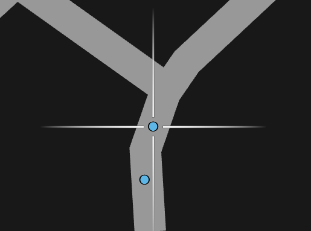
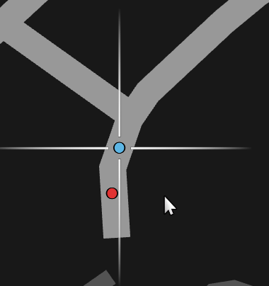
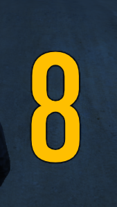
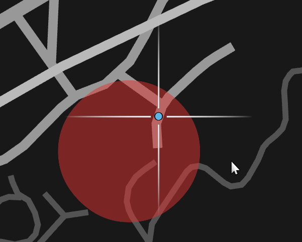
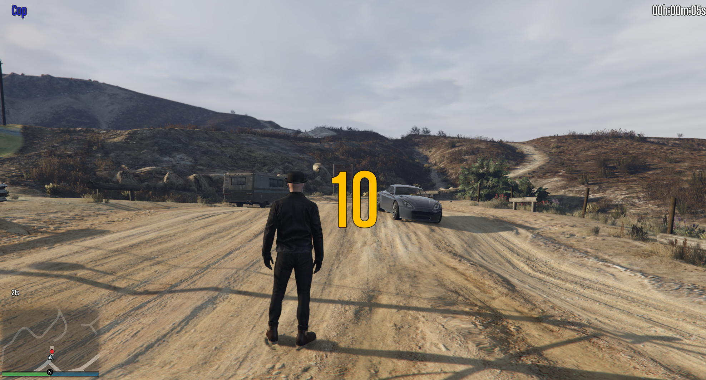
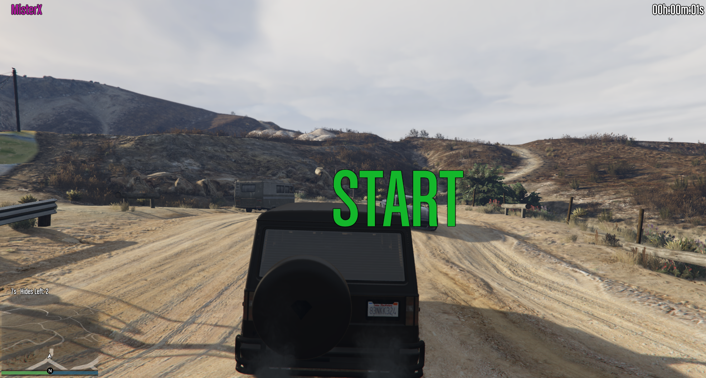

# MisterX
This FiveM Script is inspired by PietSmiet's "GTA Challenge Mister X".

It provides following Features:

* Stopwatch
* Timed Location Ping of Mister X
* Location markers for chasers
* Hide Possibility for Mister X

## Get a Role
You can get Mister X by typing `/misterX` into the chat (default `t`).
Or you can get a Cop (chaser) by typing `/cop` into the chat.
To leave a role type `/normal`.

## Starting a Chase
By typing `/startChase` into the chat, the stopwatches for all cops and Mister X begin to start ticking. A 15s (default) Timer prevents the Cops from Walking / Driving. In the bottom Left, a counter for each new Ping is ticking.  When reaching zero, the current Position of Mister X is marked on the map. 

## Settings
Following Commands can be used for changing some Settings:
`/newPingTime` to set the time between two Pings.
`/newStartTime` to set the time of the beginning Counter.

## Abilities for Mister X
Mister X has the ability to hide his location once by pressing `x`.
While hiding, a search radius is displayed on the map until the next Ping.

## End of a Chase
The Stopwatch ends when Mister X leaves his car

# Pictures
## Map Markers for Chasers

## Map Markers Cop and Mister X

## Start Countdown

## Map Marker Mister X Hiding

## Complete UI Cop

## Complete UI Mister X
